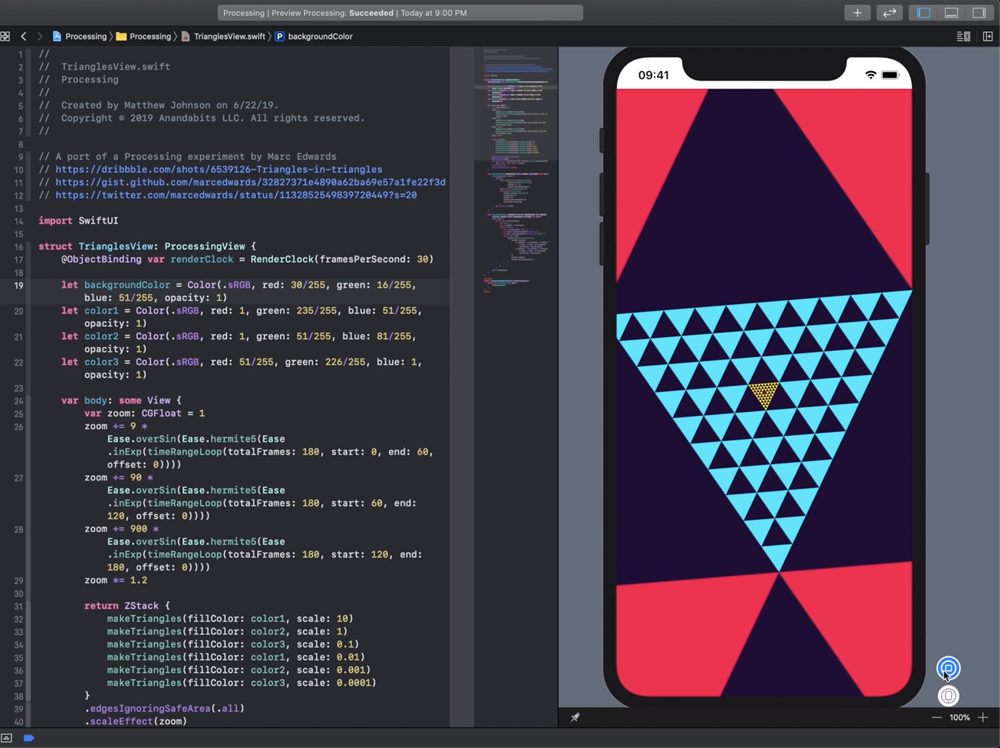
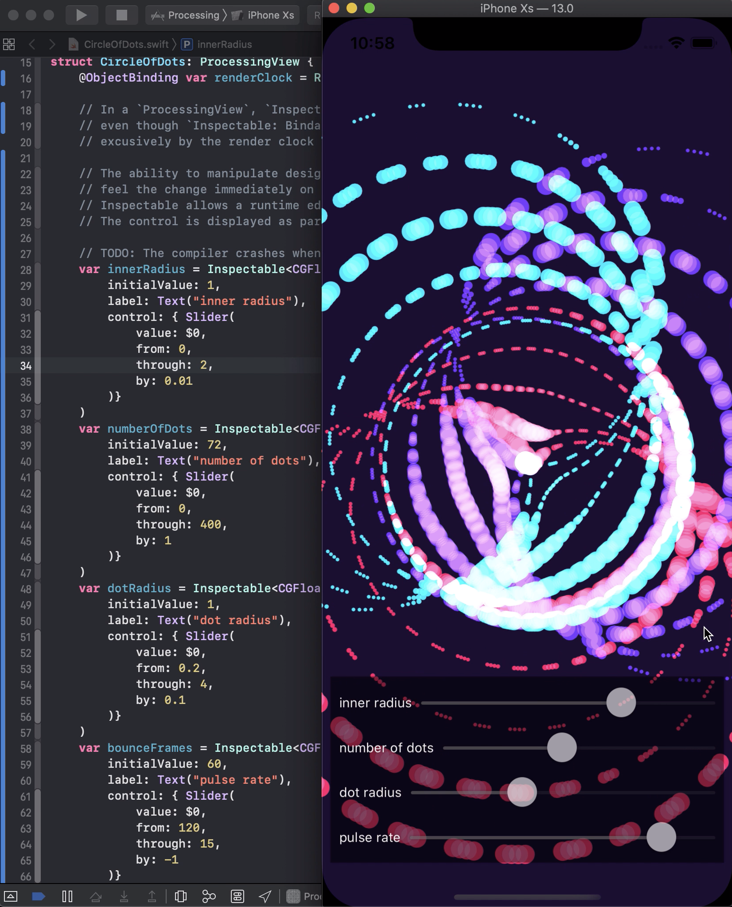

#  SwiftUI Processing Experiments

This project explores the graphics capabilities of SwiftUI.  It was inspired by the [Processing](https://processing.org) experiments [of Marc Edwards](https://mobile.twitter.com/i/moments/1057220736010448896).

I tweeted several videos of this project in action:

* https://twitter.com/anandabits/status/1142991348456460288
* https://twitter.com/anandabits/status/1145916221117874176
* https://twitter.com/anandabits/status/1145919265385660417

